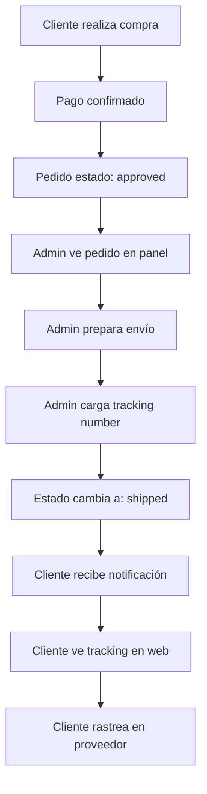

# Sistema de Seguimiento de Envíos - M-VINTAGE

## Descripción General

El sistema de seguimiento de envíos permite a los administradores gestionar el proceso de envío de pedidos y a los clientes rastrear sus compras en tiempo real, generando confianza y transparencia en el proceso de compra.

## Arquitectura del Sistema

### Flujo General


## Modelos de Base de Datos

### Actualización del Modelo Order

```python
# backend/app/models/order.py

class Order(OrderBase, table=True):
    id: Optional[int] = Field(default=None, primary_key=True)
    
    # Campos existentes...
    customer_id: int = Field(foreign_key="customer.id")
    total: float
    status: str  # 'pending', 'approved', 'shipped', 'delivered', 'cancelled'
    payment_method: PaymentMethod
    created_at: datetime = Field(default_factory=datetime.utcnow)
    
    # NUEVOS CAMPOS para seguimiento
    tracking_number: Optional[str] = Field(default=None, max_length=255)
    shipping_provider: Optional[str] = Field(default=None, max_length=100)
    shipped_at: Optional[datetime] = Field(default=None)
    estimated_delivery: Optional[datetime] = Field(default=None)
    
    # Campos de auditoría
    shipped_by: Optional[int] = Field(default=None, foreign_key="user.id")
    tracking_updated_at: Optional[datetime] = Field(default=None)
```

### Migración Alembic

```python
# backend/alembic/versions/xxx_add_shipping_tracking.py

def upgrade():
    op.add_column('order', 
        sa.Column('tracking_number', sa.String(255), nullable=True))
    op.add_column('order', 
        sa.Column('shipping_provider', sa.String(100), nullable=True))
    op.add_column('order', 
        sa.Column('shipped_at', sa.DateTime(), nullable=True))
    op.add_column('order', 
        sa.Column('estimated_delivery', sa.DateTime(), nullable=True))
    op.add_column('order', 
        sa.Column('shipped_by', sa.Integer(), nullable=True))
    op.add_column('order', 
        sa.Column('tracking_updated_at', sa.DateTime(), nullable=True))
    
    # Crear foreign key para shipped_by
    op.create_foreign_key('fk_order_shipped_by', 'order', 'user', 
                         ['shipped_by'], ['id'])

def downgrade():
    op.drop_constraint('fk_order_shipped_by', 'order', type_='foreignkey')
    op.drop_column('order', 'tracking_updated_at')
    op.drop_column('order', 'shipped_by')
    op.drop_column('order', 'estimated_delivery')
    op.drop_column('order', 'shipped_at')
    op.drop_column('order', 'shipping_provider')
    op.drop_column('order', 'tracking_number')
```

## API Endpoints

### Endpoints para Administradores

```python
# backend/app/routes/admin_orders.py

@router.get("/orders", response_model=List[OrderWithShipping])
def get_admin_orders(
    status: Optional[str] = None,
    shipping_status: Optional[str] = None,  # pending_shipment, shipped
    current_user: User = Depends(require_admin())
):
    """
    Obtener pedidos con filtros para administración.
    
    Args:
        status: Estado del pedido (pending, approved, shipped, delivered)
        shipping_status: Estado específico de envío
        - pending_shipment: Pedidos aprobados sin tracking
        - shipped: Pedidos con tracking number
    """

@router.put("/orders/{order_id}/shipping")
def update_shipping_info(
    order_id: int,
    shipping_data: ShippingUpdate,
    current_user: User = Depends(require_admin())
):
    """
    Actualizar información de envío de un pedido.
    
    Body:
    {
        "tracking_number": "CP123456789AR",
        "shipping_provider": "correo-argentino",
        "estimated_delivery": "2024-01-15T00:00:00"
    }
    """

@router.post("/orders/{order_id}/mark-shipped")
def mark_order_as_shipped(
    order_id: int,
    current_user: User = Depends(require_admin())
):
    """
    Marcar pedido como enviado - actualiza status y shipped_at.
    """
```

### DTOs y Esquemas

```python
# backend/app/schemas/shipping.py

class ShippingUpdate(BaseModel):
    tracking_number: str = Field(min_length=5, max_length=255)
    shipping_provider: str = Field(regex="^(correo-argentino|oca|andreani)$")
    estimated_delivery: Optional[datetime] = None

class OrderWithShipping(OrderRead):
    tracking_number: Optional[str] = None
    shipping_provider: Optional[str] = None  
    shipped_at: Optional[datetime] = None
    estimated_delivery: Optional[datetime] = None
    shipped_by: Optional[int] = None
    
    # Campos computados
    shipping_status: str = Field(description="pending_shipment, shipped, delivered")
    days_since_order: int = Field(description="Días desde que se creó el pedido")
    can_be_shipped: bool = Field(description="Si puede ser marcado como enviado")

class TrackingInfo(BaseModel):
    tracking_number: str
    shipping_provider: str
    tracking_url: str
    provider_name: str
    shipped_at: datetime
    estimated_delivery: Optional[datetime] = None
```

## Proveedores de Envío

### Configuración de Proveedores

```python
# backend/app/core/shipping_providers.py

SHIPPING_PROVIDERS = {
    'correo-argentino': {
        'name': 'Correo Argentino',
        'tracking_url': 'https://www.correoargentino.com.ar/formularios/ondnc?numero={}',
        'tracking_regex': r'^[A-Z]{2}[0-9]{9}[A-Z]{2}$',  # CP123456789AR
        'api_endpoint': 'https://api.correoargentino.com.ar/track',
        'support_api': True
    },
    'oca': {
        'name': 'OCA',
        'tracking_url': 'https://www1.oca.com.ar/OcaEpak_Tracking/Tracking.aspx?NumeroEnvio={}',
        'tracking_regex': r'^[0-9]{10,13}$',
        'api_endpoint': None,
        'support_api': False
    },
    'andreani': {
        'name': 'Andreani',
        'tracking_url': 'https://www.andreani.com/seguimiento/?numero={}',
        'tracking_regex': r'^[A-Z0-9]{8,15}$',
        'api_endpoint': 'https://api.andreani.com/v2/tracking',
        'support_api': True
    }
}

def validate_tracking_number(tracking: str, provider: str) -> bool:
    """Validar formato de número de tracking según proveedor."""
    if provider not in SHIPPING_PROVIDERS:
        return False
    
    pattern = SHIPPING_PROVIDERS[provider]['tracking_regex']
    return bool(re.match(pattern, tracking))

def get_tracking_url(tracking: str, provider: str) -> str:
    """Generar URL de seguimiento."""
    if provider not in SHIPPING_PROVIDERS:
        return "#"
    
    return SHIPPING_PROVIDERS[provider]['tracking_url'].format(tracking)
```

## Controladores Backend

### OrderController - Nuevos Métodos

```python
# backend/app/controllers/order_controller.py

def update_shipping_info(
    db: Session, 
    order_id: int, 
    shipping_data: ShippingUpdate,
    admin_user_id: int
) -> Order:
    """Actualizar información de envío."""
    order = get_order_by_id(db, order_id)
    if not order:
        raise HTTPException(status_code=404, detail="Order not found")
    
    if order.status != "approved":
        raise HTTPException(
            status_code=400, 
            detail="Only approved orders can be shipped"
        )
    
    # Validar tracking number
    if not validate_tracking_number(
        shipping_data.tracking_number, 
        shipping_data.shipping_provider
    ):
        raise HTTPException(
            status_code=400,
            detail=f"Invalid tracking number format for {shipping_data.shipping_provider}"
        )
    
    # Actualizar orden
    order.tracking_number = shipping_data.tracking_number
    order.shipping_provider = shipping_data.shipping_provider
    order.estimated_delivery = shipping_data.estimated_delivery
    order.shipped_by = admin_user_id
    order.tracking_updated_at = datetime.utcnow()
    
    db.add(order)
    db.commit()
    db.refresh(order)
    
    return order

def mark_as_shipped(db: Session, order_id: int, admin_user_id: int) -> Order:
    """Marcar pedido como enviado."""
    order = get_order_by_id(db, order_id)
    if not order:
        raise HTTPException(status_code=404, detail="Order not found")
    
    if not order.tracking_number:
        raise HTTPException(
            status_code=400,
            detail="Cannot ship order without tracking number"
        )
    
    order.status = "shipped"
    order.shipped_at = datetime.utcnow()
    order.shipped_by = admin_user_id
    
    db.add(order)
    db.commit()
    db.refresh(order)
    
    # Enviar notificación al cliente (opcional)
    # send_shipping_notification(order)
    
    return order

def get_orders_pending_shipment(db: Session) -> List[Order]:
    """Obtener pedidos listos para envío."""
    return db.exec(
        select(Order)
        .where(Order.status == "approved")
        .where(Order.tracking_number.is_(None))
        .order_by(Order.created_at.asc())
    ).all()

def get_shipped_orders(db: Session, days: int = 30) -> List[Order]:
    """Obtener pedidos enviados en los últimos N días."""
    cutoff_date = datetime.utcnow() - timedelta(days=days)
    return db.exec(
        select(Order)
        .where(Order.status == "shipped")
        .where(Order.shipped_at >= cutoff_date)
        .order_by(Order.shipped_at.desc())
    ).all()
```

## Estados del Pedido

### Máquina de Estados

```
ESTADOS PRINCIPALES:
┌─────────────┐    ┌─────────────┐    ┌─────────────┐    ┌─────────────┐
│   pending   │───▶│  approved   │───▶│   shipped   │───▶│ delivered   │
│ (creado)    │    │ (pago OK)   │    │(con track.) │    │(completado) │
└─────────────┘    └─────────────┘    └─────────────┘    └─────────────┘
       │                  │                  │
       ▼                  ▼                  ▼
┌─────────────┐    ┌─────────────┐    ┌─────────────┐
│ cancelled   │    │ cancelled   │    │  returned   │
│(cancelado)  │    │(cancelado)  │    │(devuelto)   │
└─────────────┘    └─────────────┘    └─────────────┘

ESTADOS ESPECÍFICOS DE ENVÍO:
- approved + no tracking_number = "Listo para Envío"
- approved + tracking_number = "Preparado para Envío"  
- shipped + tracking_number = "Enviado"
- delivered = "Entregado"
```

### Lógica de Transiciones

```python
# backend/app/core/order_states.py

class OrderState:
    PENDING = "pending"
    APPROVED = "approved" 
    SHIPPED = "shipped"
    DELIVERED = "delivered"
    CANCELLED = "cancelled"
    RETURNED = "returned"

class ShippingStatus:
    PENDING_SHIPMENT = "pending_shipment"  # approved sin tracking
    READY_TO_SHIP = "ready_to_ship"        # approved con tracking
    SHIPPED = "shipped"                     # enviado
    IN_TRANSIT = "in_transit"              # en camino (via API)
    DELIVERED = "delivered"                 # entregado

def get_shipping_status(order: Order) -> str:
    """Determinar estado de envío basado en datos de la orden."""
    if order.status == OrderState.CANCELLED:
        return "cancelled"
    
    if order.status == OrderState.PENDING:
        return "pending_payment"
    
    if order.status == OrderState.APPROVED:
        if not order.tracking_number:
            return ShippingStatus.PENDING_SHIPMENT
        elif not order.shipped_at:
            return ShippingStatus.READY_TO_SHIP
        else:
            return ShippingStatus.SHIPPED
    
    if order.status == OrderState.SHIPPED:
        return ShippingStatus.SHIPPED
    
    if order.status == OrderState.DELIVERED:
        return ShippingStatus.DELIVERED
    
    return "unknown"

def can_add_tracking(order: Order) -> bool:
    """Verificar si se puede agregar tracking a una orden."""
    return (
        order.status == OrderState.APPROVED and 
        not order.tracking_number
    )

def can_mark_shipped(order: Order) -> bool:
    """Verificar si se puede marcar como enviado."""
    return (
        order.status == OrderState.APPROVED and 
        order.tracking_number is not None and
        not order.shipped_at
    )
```

## Notificaciones

### Sistema de Notificaciones

```python
# backend/app/services/notification_service.py

async def send_shipping_notification(order: Order):
    """Enviar notificación cuando pedido es marcado como enviado."""
    try:
        # Email notification
        tracking_url = get_tracking_url(order.tracking_number, order.shipping_provider)
        provider_name = SHIPPING_PROVIDERS[order.shipping_provider]['name']
        
        email_data = {
            'to': order.customer.email,
            'subject': f'¡Tu pedido #{order.id} ha sido enviado! 📦',
            'template': 'order_shipped.html',
            'context': {
                'order': order,
                'tracking_number': order.tracking_number,
                'tracking_url': tracking_url,
                'provider_name': provider_name,
                'estimated_delivery': order.estimated_delivery
            }
        }
        
        await send_email(email_data)
        
        # WhatsApp notification (opcional)
        if order.customer.phone:
            whatsapp_msg = f"""
🎉 ¡Tu pedido #{order.id} de M-VINTAGE ha sido enviado!

📦 Número de seguimiento: {order.tracking_number}
🚚 Proveedor: {provider_name}
🔍 Rastreá tu pedido: {tracking_url}

¡Gracias por confiar en nosotros!
            """.strip()
            
            # await send_whatsapp(order.customer.phone, whatsapp_msg)
        
        logger.info(f"Shipping notification sent for order {order.id}")
        
    except Exception as e:
        logger.error(f"Failed to send shipping notification for order {order.id}: {e}")
```

## Integración con APIs Externas (Fase Avanzada)

### Correo Argentino API

```python
# backend/app/integrations/correo_argentino.py

class CorreoArgentinoAPI:
    def __init__(self, api_key: str):
        self.api_key = api_key
        self.base_url = "https://api.correoargentino.com.ar"
    
    async def get_tracking_status(self, tracking_number: str) -> dict:
        """Obtener estado actual del envío."""
        async with httpx.AsyncClient() as client:
            response = await client.get(
                f"{self.base_url}/track/{tracking_number}",
                headers={"Authorization": f"Bearer {self.api_key}"}
            )
            return response.json()
    
    async def create_shipment(self, order_data: dict) -> dict:
        """Crear envío en Correo Argentino."""
        # Implementar según API docs
        pass

# Task para actualizar estados automáticamente
@celery.task
def update_tracking_statuses():
    """Tarea periódica para actualizar estados de tracking."""
    with SessionLocal() as db:
        shipped_orders = get_shipped_orders(db, days=14)  # Últimas 2 semanas
        
        for order in shipped_orders:
            if order.shipping_provider == "correo-argentino":
                try:
                    api = CorreoArgentinoAPI(settings.CORREO_ARGENTINO_API_KEY)
                    status = await api.get_tracking_status(order.tracking_number)
                    
                    # Actualizar estado si cambió
                    if status.get('delivered'):
                        order.status = OrderState.DELIVERED
                        order.delivered_at = datetime.utcnow()
                        db.commit()
                        
                except Exception as e:
                    logger.error(f"Error updating tracking for order {order.id}: {e}")
```

## Métricas y Analytics

### KPIs de Seguimiento

```python
# backend/app/analytics/shipping_metrics.py

def get_shipping_metrics(db: Session, days: int = 30) -> dict:
    """Obtener métricas de envío."""
    cutoff_date = datetime.utcnow() - timedelta(days=days)
    
    total_orders = db.scalar(
        select(func.count(Order.id))
        .where(Order.created_at >= cutoff_date)
    )
    
    shipped_orders = db.scalar(
        select(func.count(Order.id))
        .where(Order.shipped_at >= cutoff_date)
    )
    
    avg_processing_time = db.scalar(
        select(func.avg(func.extract('epoch', Order.shipped_at - Order.created_at)))
        .where(Order.shipped_at >= cutoff_date)
    )
    
    provider_usage = db.exec(
        select(Order.shipping_provider, func.count(Order.id))
        .where(Order.shipped_at >= cutoff_date)
        .group_by(Order.shipping_provider)
    ).all()
    
    return {
        'total_orders': total_orders,
        'shipped_orders': shipped_orders,
        'shipping_rate': (shipped_orders / total_orders * 100) if total_orders > 0 else 0,
        'avg_processing_hours': round(avg_processing_time / 3600, 1) if avg_processing_time else 0,
        'provider_usage': dict(provider_usage)
    }
```

## Configuración y Variables de Entorno

```python
# backend/app/core/config.py

class Settings(BaseSettings):
    # Configuraciones existentes...
    
    # Shipping providers API keys
    CORREO_ARGENTINO_API_KEY: Optional[str] = None
    OCA_API_KEY: Optional[str] = None
    ANDREANI_API_KEY: Optional[str] = None
    
    # Shipping settings
    DEFAULT_SHIPPING_PROVIDER: str = "correo-argentino"
    AUTO_UPDATE_TRACKING: bool = False
    TRACKING_UPDATE_INTERVAL_HOURS: int = 4
    
    # Notifications
    SEND_SHIPPING_EMAILS: bool = True
    SEND_SHIPPING_WHATSAPP: bool = False
    WHATSAPP_API_TOKEN: Optional[str] = None
```

## Testing

### Tests de Integración

```python
# backend/tests/test_shipping_system.py

def test_update_shipping_info_success():
    """Test actualización exitosa de info de envío."""
    # Setup
    order = create_test_order(status="approved")
    shipping_data = ShippingUpdate(
        tracking_number="CP123456789AR",
        shipping_provider="correo-argentino"
    )
    
    # Execute
    updated_order = update_shipping_info(db, order.id, shipping_data, admin_user.id)
    
    # Assert
    assert updated_order.tracking_number == "CP123456789AR"
    assert updated_order.shipping_provider == "correo-argentino"
    assert updated_order.shipped_by == admin_user.id

def test_mark_as_shipped_success():
    """Test marcar como enviado."""
    # Setup
    order = create_test_order_with_tracking()
    
    # Execute
    shipped_order = mark_as_shipped(db, order.id, admin_user.id)
    
    # Assert
    assert shipped_order.status == "shipped"
    assert shipped_order.shipped_at is not None

def test_tracking_number_validation():
    """Test validación de números de tracking."""
    assert validate_tracking_number("CP123456789AR", "correo-argentino") == True
    assert validate_tracking_number("12345", "correo-argentino") == False
    assert validate_tracking_number("1234567890", "oca") == True
```

## Próximos Pasos

1. **Implementar modelos y migraciones** - Actualizar esquema de BD
2. **Crear endpoints admin** - APIs para gestión de envíos  
3. **Desarrollar interfaz admin** - Panel para cargar tracking
4. **Mejorar experiencia cliente** - Vista de seguimiento
5. **Configurar notificaciones** - Emails automáticos
6. **Integrar APIs externas** - Correo Argentino, OCA, Andreani
7. **Implementar métricas** - Dashboard y analytics

## Referencias

- [Documentación Correo Argentino API](https://www.correoargentino.com.ar/api-docs)
- [OCA Tracking](https://www1.oca.com.ar/OcaEpak_Tracking/)
- [Andreani API](https://developers.andreani.com/)